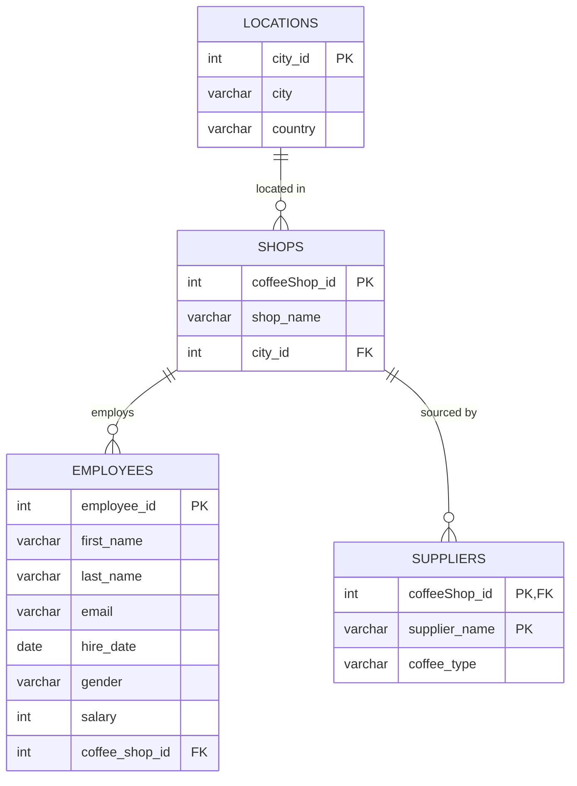

<div align="center">

# ☕ Coffee Shop Database System

### A relational database project modeling a multi-location coffee shop chain

[](#)
[](#)
[](#)
[](#license)

</div>

---

## 📖 Overview

This project designs and builds a relational database for a fictional coffee shop chain — **Common Grounds, Early Rise, Ancient Bean, Urban Grind, and Trembling Cup** — modeling how a real multi-location retail business tracks its **employees**, **shop locations**, **cities**, and **coffee suppliers**.

It's structured as a series of modular SQL scripts (schema creation → constraints → seed data → updates → queries), reflecting a real-world database build-out workflow rather than a single monolithic script.

## 🛠️ Tech Stack

- **SQL** (DDL & DML)
- Relational schema design with primary/composite keys and foreign key constraints
- Compatible with MySQL, PostgreSQL, and other standard SQL engines

## 🧩 Entity Relationship Diagram



## 📂 Project Structure

```
.
├── Create_table_Employee.sql              # Creates the EMPLOYEES table
├── Create_table_Locations_Suppliers.sql   # Creates LOCATIONS and SUPPLIERS tables
├── Create_table_Shops.sql                 # Creates the SHOPS table
├── Add_ForeignK_cityId-shops.sql          # FK: SHOPS.city_id → LOCATIONS.city_id
├── Add_ForeignK_shop-employees.sql        # FK: EMPLOYEES.coffee_shop_id → SHOPS.coffeeShop_id
├── insert_TABLE_location.sql              # Seeds LOCATIONS data
├── insert_Table_shops.sql                 # Seeds SHOPS data
├── insert_TABLE_suppliers.sql             # Seeds SUPPLIERS data
├── updt_emloyee&shop.sql                  # Updates employee-to-shop assignments
└── practice_query_file.sql                # Sample SELECT queries
```

## 🚀 Getting Started

### Prerequisites
- A running SQL database instance (MySQL, PostgreSQL, or similar)
- A SQL client (CLI, DBeaver, TablePlus, etc.)

### Setup

Run scripts in this order to respect table and foreign key dependencies:

```bash
# 1. Create tables (parents before children)
mysql < Create_table_Locations_Suppliers.sql
mysql < Create_table_Shops.sql
mysql < Create_table_Employee.sql

# 2. Add foreign key constraints
mysql < Add_ForeignK_cityId-shops.sql
mysql < Add_ForeignK_shop-employees.sql

# 3. Seed data
mysql < insert_TABLE_location.sql
mysql < insert_Table_shops.sql
mysql < insert_TABLE_suppliers.sql

# 4. Apply updates
mysql < "updt_emloyee&shop.sql"

# 5. Explore the data
mysql < practice_query_file.sql
```

> Swap `mysql <` for your engine's equivalent (e.g. `psql -f` for PostgreSQL).

## 💡 Skills Demonstrated

- Relational schema design (primary keys, composite keys, foreign keys)
- Multi-table `CREATE TABLE` and constraint scripting
- Structured data seeding with `INSERT`
- Data maintenance with `UPDATE`
- Query writing and validation with `SELECT`

## 🗺️ Roadmap

- [ ] Finalize `SHOPS` table definition
- [ ] Wire up both foreign key constraint scripts
- [ ] Add employee seed data
- [ ] Standardize column naming conventions across all scripts
- [ ] Add missing city records for existing shop references
- [ ] Expand `practice_query_file.sql` with multi-table `JOIN` queries and aggregate reporting

## 📄 License

This project is available under the [MIT License](#).

---

<div align="center">

**Built as a hands-on SQL / relational database design project.**
Feedback and suggestions welcome — feel free to open an issue or PR!

</div>
